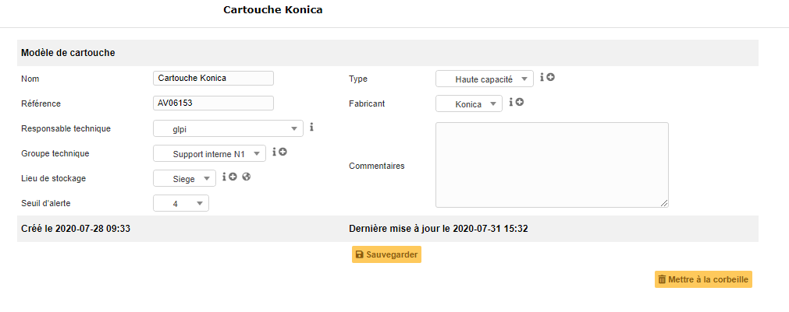
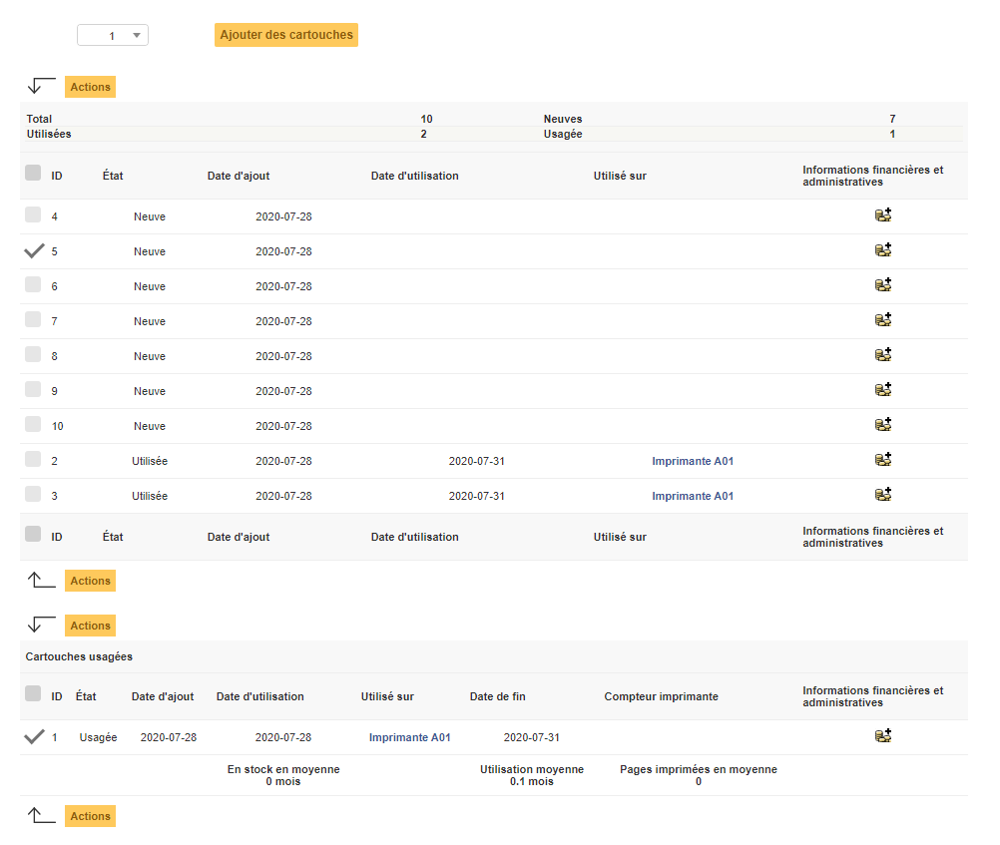
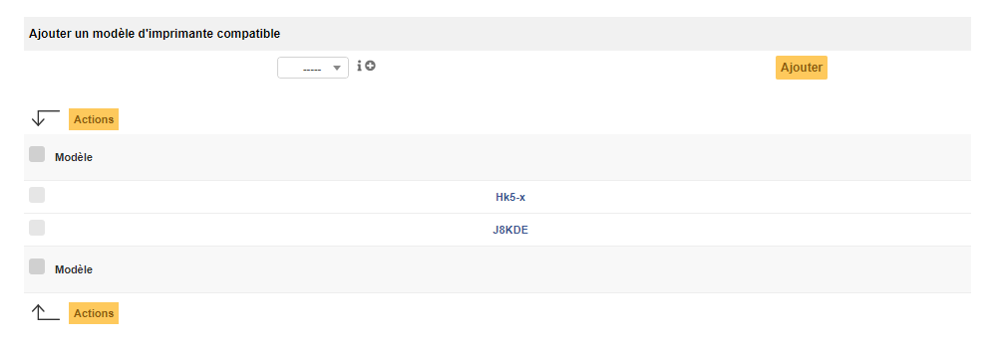

Cartouches
==========

Ce module permet de gérer différents modèles de cartouches d'imprimantes, les quantités et l'affectation des cartouches sur les différentes imprimantes du parc.

Dans la fiche d'une cartouche, l'onglet principal concerne le modèle et ses informations relatives:

-   le nom, le fabricant, le type, la référence, le lieu de stockage;
-   le ou les personne(s) en charge de ces matériels: responsable technique, groupe technique.

Le champ 'Seuil d'alerte' correspond au nombre critique de cartouche associée au modèle à partir duquel une alerte est déclenchée afin de prévenir un manque dans le stock de l'organisation.

.. note::
	Pour que les alertes fonctionnent, les notifications au sein de GLPI doivent être actives !

Les différents onglets
----------------------

Cartouches
~~~~~~~~~~

C'est depuis cet onglet qu'il est possible de visualiser l'état des cartouches, l'imprimante utilisée et d'agir sur les cartouches : ajout, bascule dans le stock, suppression et la gestion administrative et financière.

Un premier tableau liste les cartouches neuves ou utilisées et un second tableau liste les cartouches usagées.

Modèles d'imprimantes
~~~~~~~~~~~~~~~~~~~~~

Cet onglet permet de matérialiser la compatibilité des cartouches avec un ou plusieurs modèles d'imprimante déjà renseignés dans GLPI.

.. warning::
	Il est possible d'associer les cartouches avec les imprimantes entre elles uniquement  une fois que la compatibilité est matérialisée entre un modéle de cartouche et un modèle d'imprimante !

.. include:: onglets/gestion.rst

.. include:: ../onglets/documents.rst

.. include:: ../onglets/external-links.rst

.. include:: ../onglets/notes.rst

.. include:: ../onglets/historical.rst

.. include:: ../onglets/all.rst

Les différentes actions
-----------------------

*   :doc:`Ajouter un modèle de cartouche <../../Les_différentes_actions/creer_un_nouvel_objet>`
*   :doc:`Visualiser les modèles de cartouche <../../Les_différentes_actions/visualiser_un_objet>`
*   :doc:`Modifier un modèle de cartouche <../../Les_différentes_actions/modifier_un_objet>`
*   :doc:`Supprimer un modèle de cartouche <../../Les_différentes_actions/supprimer_un_objet>`
*   :doc:`Associer un document à un modèle de cartouche <../../Les_différentes_actions/associer_un_document_a_un_objet>`
*   :doc:`Transférer un modèle de cartouche <../../Les_différentes_actions/transferer_un_objet>`