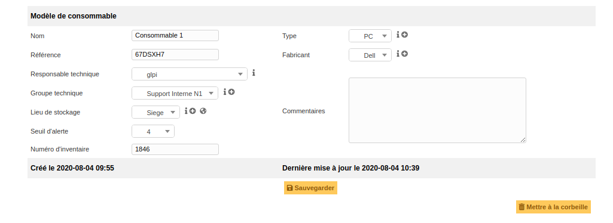
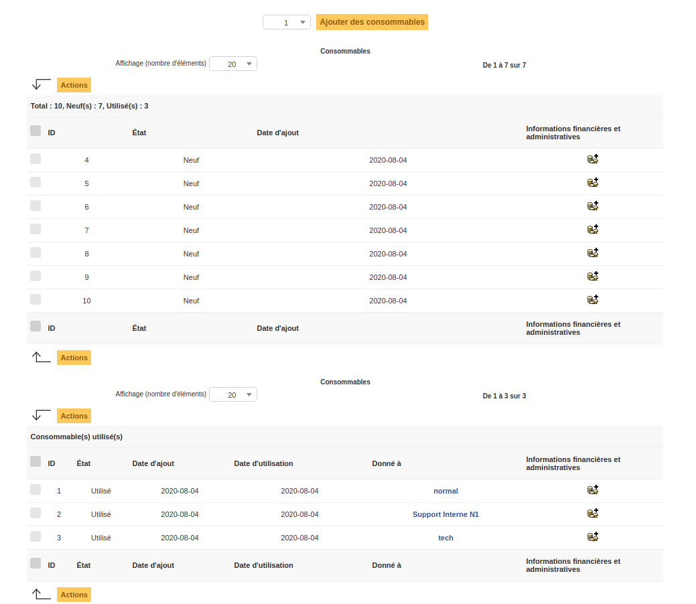

Consommables
============

Ce module permet de gérer différents modèles de consommables, les quantités de consommables associées et l'affectation des consommables sur les utilisateurs et les groupes de GLPI.

Dans la fiche d'un consommable, l'onglet principal concerne le modèle et ses informations relatives:

*	le nom, le fabricant, le type, la référence, le lieu de stockage;
*	le ou les personne(s) en charge de ces matériels: responsable technique, groupe technique.

Le champ 'Seuil d'alerte' correspond au nombre critique, de consommable associé au modèle, à partir duquel une alerte est déclenchée afin de prévenir un manque dans le stock de l'organisation.

.. warning::
	Pour que les alertes fonctionnent, les notifications au sein de GLPI doivent être actives !

.. note::
	- Le changement d'état d'un consommable ( neuf > utilisé ) se fait quand on affecte ce dernier à un utilisateur ou un groupe de GLPI contrairement à la gestion des cartouches !
	- La gestion des stocks partagés est possible en définissant le consommable comme récursif sur une entité. Les consommables seront alors disponibles pour toutes les sous-entités de GLPI.

Les différents onglets
----------------------

Consommables
~~~~~~~~~~~~

 Depuis cet onglet, il est possible:

 *	de visualiser l'état des consommables;
 *	de visualiser leur affectation;
 *	d'agir sur les consommables : ajout, bascule dans le stock, affectation, suppression et la gestion administrative et financière.

Un premier tableau liste les consommables neufs et un second tableau liste les consommables utilisés (affectés).

.. include:: onglets/gestion.rst

.. include:: ../onglets/documents.rst

.. include:: ../onglets/external-links.rst

.. include:: ../onglets/notes.rst

.. include:: ../onglets/historical.rst

.. include:: ../onglets/all.rst

Les différentes actions
-----------------------

*   :doc:`Ajouter un modèle de consommables <../../Les_différentes_actions/creer_un_nouvel_objet>`
*   :doc:`Visualiser les modèles de consommables <../../Les_différentes_actions/visualiser_un_objet>`
*   :doc:`Modifier un modèle de consommables <../../Les_différentes_actions/modifier_un_objet>`
*   :doc:`Supprimer un modèle de consommables <../../Les_différentes_actions/supprimer_un_objet>`
*   :doc:`Associer un document à un modèle de consommables <../../Les_différentes_actions/associer_un_document_a_un_objet>`
*   :doc:`Transférer un modèle de consommables <../../Les_différentes_actions/transferer_un_objet>`
*	:doc:`Donner un consommable <../../Les_différentes_actions/donner_un_consommable>`
