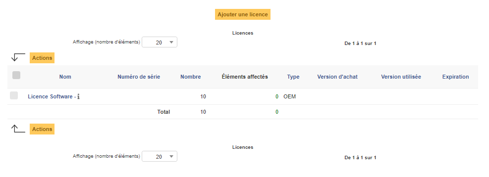

Logiciels
=========

GLPI intègre une gestion des logiciels et de leurs versions.

Un logiciel est par défaut associé à une entité : c'est-à-dire qu'il y aura autant de logiciels dans la base qu'il y a d'entités. Rendre un logiciel visible dans les sous-entités permet de faire une gestion plus fine.

Certains champs sont spécifiques dans la fiche du logiciel :

* **Mise à jour** est une donnée informative, à partir de laquelle aucun traitement n'est effectué et qui indique que le logiciel est une mise à jour d'un autre. 
* **Catégorie** permet des regroupements par nature sur la liste des logiciels d'un ordinateur. 
* **Associable à un ticket** définit la visibilité du logiciel dans la liste déroulante "Matériel" d'un ticket.

Il est possible d'utiliser les :doc:`gabarits avec les logiciels <../generalites/gabarits>`.

.. note::
  Si GLPI est couplé avec un outil d'inventaire tiers, les logiciels peuvent être importés automatiquement et dans ce cas un :doc:'Dictionnaire <../administration/dictionnaires.rst> peut être utilisé pour filtrer ou nettoyer les données.

  Dans le cas où plusieurs entités existent, la liste des logiciels peut devenir longue, en partie dû aux doublons (1 logiciel par entité). Une gestion fine des logiciels, licences et versions peut consister à regrouper les logiciels identiques dans une même entité puis à rendre récursif les éléments qui peuvent l'être.

Les différents onglets
----------------------

Versions
~~~~~~~~

Dans cet onglet, il est possible de définir une ou plusieurs versions associées au logiciel et de consulter les installations sur les Ordinateurs.

Champs spécifiques :

* **Nom** : correspond au numéro de version ;
* **Statut** : en préconisations ITIL, il permet de suivre la DSL (bibliothèque de stockage des versions autorisées) ;
* **Système d'exploitation** : le système d'exploitation sur lequel fonctionne cette version de logiciel ;
* **Installations** : nombre d'installations de la version ;
* **Commentaires**.

.. note::
  Pour être précis, c'est **la Version d'un Logiciel** qui est l'élément pouvant être associé à un **Ordinateur** de GLPI, et non le logiciel lui même.

Licences
~~~~~~~~

Cet onglet permet de consulter les licences associées au logiciel et d'accéder rapidement à la création de :doc:'licences <../gestion/licenses>' de GLPI afin d'en ajouter pour le logiciel.

Installations
~~~~~~~~~~~~~

Cet onglet permet de consulter une liste d'installations, c'est à dire une liste des **Versions** du logiciel installées sur les **Ordinateurs** présents dans GLPI.

.. note::
 La colonne licence est remplie uniquement lorsque la licence est affectée à l'ordinateur concerné.
   

Gestion
~~~~~~~

.. warning::
 La gestion financière est effectuée au niveau des licences, alors que celle présente dans les logiciels sert uniquement de modèle pour les licences associées à celui-ci.

Dans cet onglet, il est possible d'établir la fiche administrative du matériel. Les informations sont groupées de la manière suivante:

**Cycle de vie du matériel**

Dans ce groupe, il est possible de renseigner toutes les dates importantes liées au matériel (commande, livraison, achat, mise en service, réforme, dernier inventaire physique).

.. image:: /modules/parc/onglets/images/lifecycle-gestion-tab.png
 :alt: Cycle de vie d'un matériel
 :align: center

**Informations financières et administratives**

Ce groupe rassemble :

* **Fournisseur** : tiers qui a vendu le matériel ;
* **Budget** : budget sur lequel ce matériel a été acheté (voir la gestion des budgets) ;
* **Numéro de commande** : numéro de la commande associée au matériel ;
* **Numéro d'immobilisation** ;
* **Numéro de facture** : numéro de la facture du matériel ;
* **Bon de livraison** ;
* **Valeur** : coût du matériel ;
* **Valeur extension garantie** : coût de l'extension de garantie, mais de préférence utiliser les contrats ;
* **Valeur nette comptable** : c'est le calcul automatique de la valeur brute d'un matériel minorée du montant des amortissements ;
* **Type d'amortissement** : choix du type d'amortissement entre linéaire et dégressif ;
* **Durée d'amortissement** : durée d'amortissement exprimée en années ;
* **Coefficient d'amortissement** : coefficient s'appliquant sur un type d'amortissement linéaire afin d'obtenir les valeurs du type dégressif. Il est donc utilisé uniquement si le type d'amortissement est dégressif ;
* **TCO** (valeur+montant des interventions) : le coût total de possession qui intègre tous les éléments constitutifs d'un produit facturé ;
* **TCO mensuel** : TCO divisé par le nombre de mois entre la date d'aujourd'hui et la date d'achat du matériel ;
* **Criticité business** : Permet de définir un niveau de criticité d'un point de vue administratif au matériel.

.. image:: /modules/parc/onglets/images/finance-gestion-tab.png
 :alt: Informations financières et administratives d'un matériel
 :align: center

**Informations sur la garantie**

* **Date de début de garantie** : date à laquelle le garantie du matériel démarre ;
* **Informations sur la garantie** : texte qualifiant la garantie ;
* **Durée de garantie** : durée de la garantie exprimée en mois ;

.. image:: /modules/parc/onglets/images/guarantee-gestion-tab.png
 :alt: Informations sur la garantie d'un matériel
 :align: center

.. note::
 L'ensemble des dates définies peut être géré automatiquement en fonction des changements de statut des matériels. Certaines dates peuvent également être copiées à partir d'une autre date.

.. include:: ../onglets/contract.rst

.. include:: ../onglets/documents.rst

.. include:: ../onglets/knowledgebase.rst

.. include:: ../onglets/tickets.rst

.. include:: onglets/problemes.rst

.. include:: onglets/changes.rst

.. include:: ../onglets/external-links.rst

.. include:: ../onglets/notes.rst

.. include:: ../onglets/reservations.rst

Domaines
~~~~~~~~

Appliances
~~~~~~~~~~

.. include:: ../onglets/historical.rst

Regroupement
~~~~~~~~~~~~

.. warning::
 Cet onglet n'est disponible que pour les plateformes multi-entités et l'option **Sous-entités** du logiciel doit être sur **Oui**

Il permet de regrouper les logiciels des entités filles sur l'entité mère.

.. note::
 Pour en savoir plus, consultez l'action de regroupement en bas de page.

.. include:: ../onglets/all.rst

Les différentes actions
-----------------------

*   :doc:`Ajouter un logiciel <../../Les_différentes_actions/creer_un_nouvel_objet>`
*   :doc:`Visualiser un logiciel <../../Les_différentes_actions/visualiser_un_objet>`
*   :doc:`Modifier un logiciel <../../Les_différentes_actions/modifier_un_objet>`
*   :doc:`Supprimer un logiciel <../../Les_différentes_actions/supprimer_un_objet>`
*   :doc:`Associer un document à un logiciel <../../Les_différentes_actions/associer_un_document_a_un_objet>`
*   :doc:`Transférer un logiciel <../../Les_différentes_actions/transferer_un_objet>`
*   :doc:`Regroupement <../../Les_différentes_actions/regroupement>`