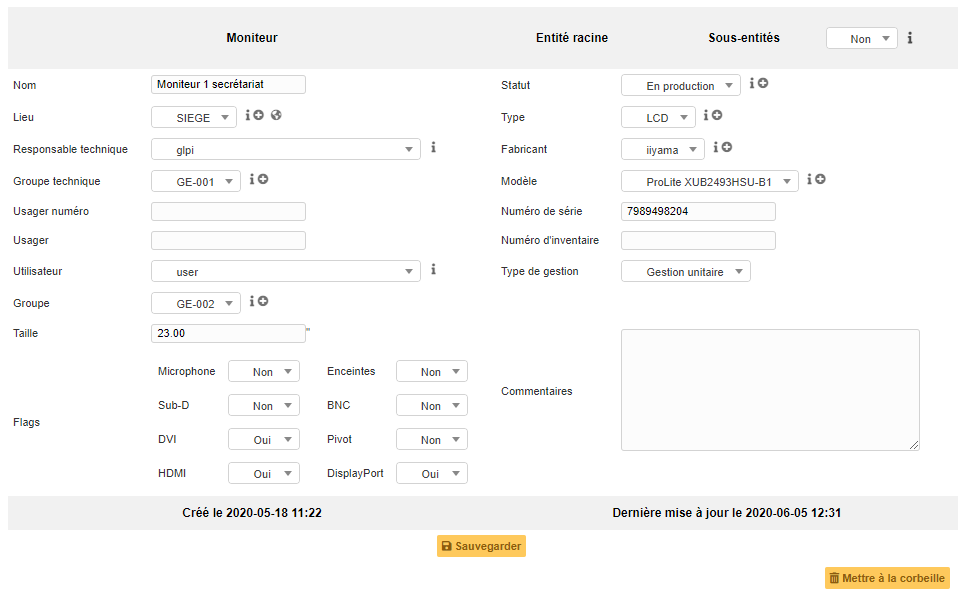

Moniteurs
=========

La fiche d'un moniteur regroupe plusieurs informations :

-   Sur les caractéristiques générales du matériel : le fabricant, le modèle, le type, le numéro de série ;
-   Sur les spécifications du matériel : la taille, les types de port : VGA, DVI, HDMI, DisplayPort, présence d'enceinte ;
-   Sur la gestion du matériel : le responsable technique, son statut, son lieu ;
-   Sur les utilisateurs du matériel : présent ou non dans GLPI et la gestion du groupe d'utilisateur.

.. note::
	Il est possible de gérer les moniteurs de manière unitaire ou globale.

	La gestion unitaire correspond à une gestion classique (un moniteur pour un ordinateur) alors que dans la gestion globale le moniteur devient un élément virtuel global qui sera connecté à plusieurs ordinateurs.

	La gestion globale permet de limiter le nombre d'éléments à gérer dans le cas où ceux-ci ne constituent pas une donnée stratégique dans la gestion du parc informatique.

Il est possible d'utiliser les :doc:`gabarits avec les moniteurs <../generalites/gabarits>`.

Les différents onglets
----------------------

Moniteur
~~~~~~~~

Premier onglet de la fiche, il regroupe les informations principales du moniteur.

.. include:: onglets/impact-analysis.rst

Systèmes d'exploitation
~~~~~~~~~~~~~~~~~~~~~~~

.. versionadded:: 9.5

Dans cet onglet, il est donc possible d'associer un Système d'exploitation avec un moniteur.

.. note::  
  * Les systèmes d'exploitations sont des **intitulés** dans GLPI, il est possible de les créer au préalable.
  * Les objets **Système d'exploitation** et **Moniteur** sont désormais associables afin d'intégrer au mieux certains matériels spécifiques dans GLPI.

.. include:: onglets/connexions.rst

.. include:: onglets/gestion.rst

.. include:: ../onglets/contra~ct.rst

.. include:: ../onglets/documents.rst

.. include:: ../onglets/knowledgebase.rst

.. include:: ../onglets/tickets.rst

.. include:: onglets/problemes.rst

.. include:: ../onglets/external-links.rst

.. include:: ../onglets/notes.rst

.. include:: onglets/reservations.rst

Domaines
~~~~~~~~

Appliances
~~~~~~~~~~

.. include:: ../onglets/historique.rst

.. include:: ../onglets/debug.rst

.. include:: ../onglets/all.rst

Les différentes actions
-----------------------

*   :doc:`Ajouter un moniteur <../../Les_différentes_actions/creer_un_nouvel_objet>`
*   :doc:`Visualiser un moniteur <../../Les_différentes_actions/visualiser_un_objet>`
*   :doc:`Modifier un moniteur <../../Les_différentes_actions/modifier_un_objet>`
*   :doc:`Supprimer un moniteur <../../Les_différentes_actions/supprimer_un_objet>`
*   :doc:`Associer un document à un moniteur <../../Les_différentes_actions/associer_un_document_a_un_objet>`
*   :doc:`Transférer un moniteur <../../Les_différentes_actions/transferer_un_objet>`