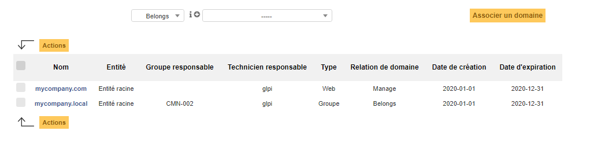

Domaines
~~~~~~~~

.. versionadded:: 9.5

Dans cet onglet de la fiche des objets, il pourra être établi un lien entre ce dernier et un domaine informatique matérialisé dans GLPI.

Il existe deux types de lien :

- **Appartenance**, l'objet fait parti du domaine.
- **Gestion**, l'objet est un élément du parc qui gère le domaine ( un serveur Active Directory par exemple)

.. note::
  Le lien est créé dans les deux sens, il sera consultable depuis la fiche de l'objet et depuis la fiche du domaine.

