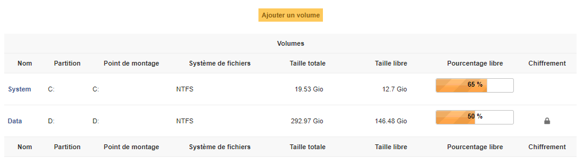

Volumes
~~~~~~~

Dans cet onglet, sont gérés les volumes liés à l'objet. Un volume est caractérisé par son nom, la partition physique, son point de montage, son système de fichiers ainsi que sa taille. Il est également possible de définir la taille restante libre sur le volume. Enfin, si il existe un chiffrement total ou partiel sur le volume il peut être renseigné ainsi que son algorithme et l'outil qui a servi au chiffrement.

.. note::
   En cas d'utilisation d'un outil d'inventaire tiers, ces informations peuvent être automatiquement importées et mises à jour.

