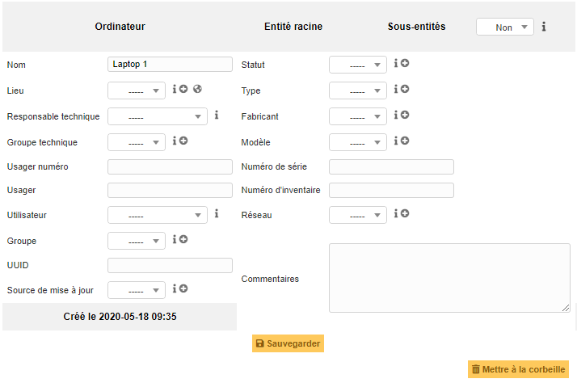
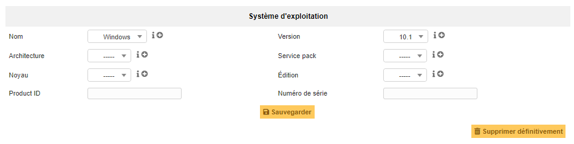
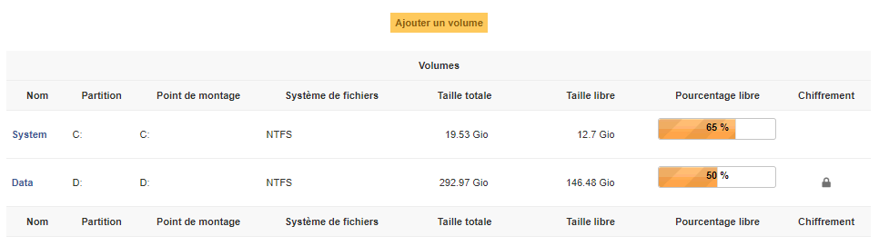
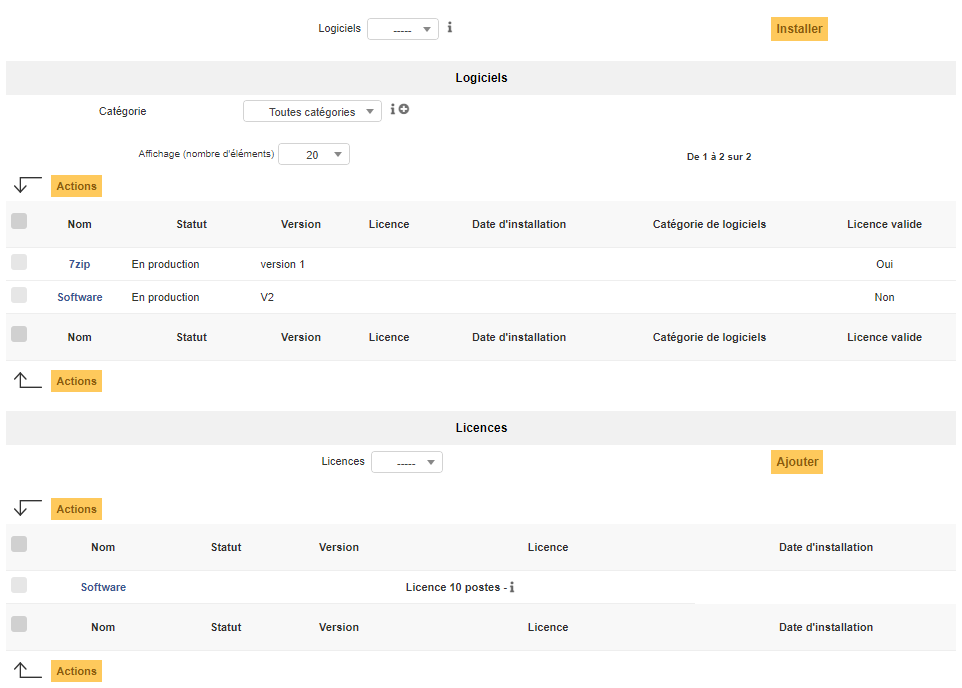
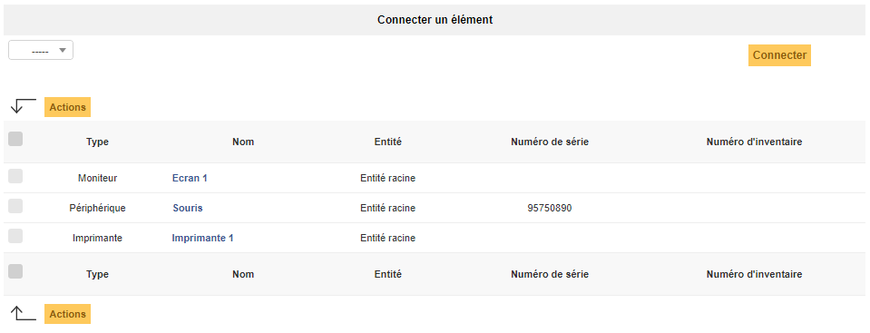
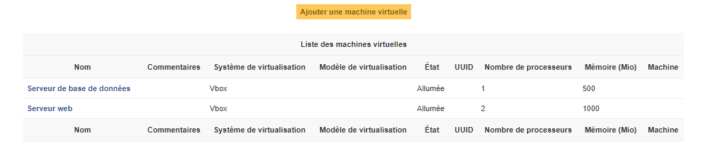
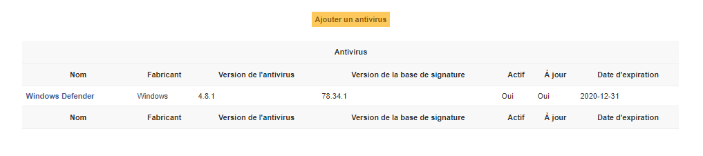
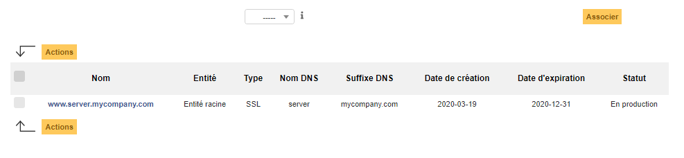
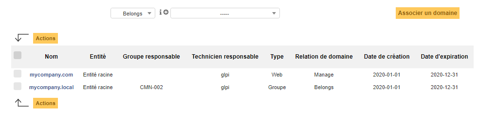

Ordinateurs
===========

Le terme **Ordinateur** dans GLPI est générique. Pour intégrer cette catégorie d'objet, un équipement doit posséder au minimum un processeur, un système d'exploitation et des logiciels installés.

Plusieurs équipements rentrent donc dans cette catégorie:

* Ordinateur avec unité centrale
* Ordinateur portable
* Serveur
* Smartphone
* Tablette

Dans la fiche d'un ordinateur, on trouve un certain nombre d'informations concernant le système d'exploitation (nom, version, service pack, numéro de série, product ID), les caractéristiques générales (fabricant, modèle, type, numéro de série), les informations de gestion (responsable technique, statut, localisation) et les usagers du poste (connus ou non dans GLPI).

D'autres champs sont informatifs, comme `Réseau` (type de connexion au poste), et la `source de la mise à jour` qui est un intitulé indiquant d'où proviennent les mises à jour d'un poste (oui/non, Windows update, yum, apt, etc).

.. note::

   * Dans le cas d'une utilisation de GLPI couplé avec un outil d'inventaire, différentes informations sur l'importation sont également disponibles.
   * Il est possible d'utiliser les :doc:`gabarits avec les ordinateurs <../generalites/gabarits>`.

Les différents onglets
----------------------

Ordinateur
~~~~~~~~~~

Premier onglet de l'objet, celui ci regroupe des informations généralistes comme:

* Le nom de l'objet dans GLPI, son fabricant et son modèle ;
* Son type, le lieu physique et son statut au sein du parc ;
* Son affectation auprès des membres de l'organisation ainsi que des groupes/utilisateurs de la plateforme.

D'autres champs viennent compléter cet onglet notamment pour l'identification technique de l'objet: 

* Numéro de série
* Numéro d'inventaire
* UUID

.. include:: onglets/impact-analysis.rst

Systèmes d'exploitation
~~~~~~~~~~~~~~~~~~~~~~~

Dans cet onglet il est possible d'affecter un système d'exploitation à l'ordinateur.

.. note::
  * Les systèmes d'exploitations sont des intitulés dans GLPI, il est donc possible de les créer au préalable. 
  * En cas d'utilisation d'un outil d'inventaire tiers, ces informations peuvent être automatiquement importées et mises à jour !

.. include:: onglets/composants.rst

Volumes
~~~~~~~

Dans cet onglet, sont gérés les volumes de l'ordinateur. Un volume lié à un ordinateur est caractérisé par son nom, la partition physique, son point de montage, son système de fichiers ainsi que sa taille. Il est également possible de définir la taille restant libre sur le volume.

.. note::
   En cas d'utilisation d'un outil d'inventaire tiers, ces informations peuvent être automatiquement importées et mises à jour.

Logiciels (et licences)
~~~~~~~~~~~~~~~~~~~~~~~

Cet onglet permet d'associer à un ordinateur les logiciels et les licences existants déjà dans GLPI. Ceux-ci sont triés par catégorie et sont caractérisés par leur nom, leur version ainsi que le statut de cette dernière.

Si une licence est associée à l'utilisation de ce logiciel sur cet ordinateur, l'information sera également présentée.

.. note::

    * La liste déroulante énumère les logiciels disponibles dans l'entité.
    * En cas d'utilisation d'un outil d'inventaire tiers, les logiciels peuvent être automatiquement importés dans GLPI, associés à l'ordinateur et mettre à jour la liste à chaque actualisation de l'inventaire !

Connexions
~~~~~~~~~~

Dans cet onglet, il est possible d'etablir des connexions avec d'autres matériels du parc présents dans GLPI.
Concernant les objets **Ordinateurs**, des liens peuvent être établis avec:

  * Imprimante
  * Moniteur
  * Périphérique
  * Téléphone

.. note::
  Le lien est établi dans les deux sens, il sera visible depuis l'ordinateur et depuis l'équipement associé.

.. include:: onglets/ports-reseau.rst

.. include:: onglets/gestion.rst

.. include:: onglets/contrat.rst

.. include:: ../onglets/documents.rst

Virtualisation
~~~~~~~~~~~~~~

Dans cet onglet, on retrouve tous les systèmes de virtualisation (machines virtuelles, containers, jails, ...) associés à un hôte (host) ou l'hôte sur lequel un système de virtualisation est installé. Les informations disponibles varient d'un système à l'autre, en fonction des information qu'il est effectivement possible d'obtenir.

Pour une machine virtuelle par exemple, on trouvera son nom, son système de virtualisation, son modèle de virtualisation, l'état de la machine virtuelle, la mémoire allouée ainsi que le nom de la machine physique (hôte) et le nombre de processeurs logiques.

.. note::
  GLPI réalise la liaison entre un hôte et une machine virtuelle en se basant sur l'identifiant unique (uuid). Dans certains cas, il arrive que l'uuid soit différent au sein de la machine physique et virtuelle, la liaison est alors impossible.

  Le seul moyen d'associer manuellement une machine virtuelle à une machine physique est d'attribuer à la machine virtuelle déclarée sur l'hôte et à la machine virtuelle dans GLPI un uuid identique.

  En cas d'utilisation d'un outil d'inventaire tiers, ces informations peuvent être automatiquement importées et mises à jour.

Antivirus
~~~~~~~~~

Cet onglet permet de renseigner le ou les antivirus associé(s) à l'ordinateur. 
L'antivirus se caractérise par le nom du produit, son fabricant et toutes les informations relatives à son état: 

  * actif ou non ;
  * à jour ou non ; 
  * la version du logiciel et de la base de signature ;
  * et enfin son expiration.

.. note::
  En cas d'utilisation d'un outil d'inventaire tiers, ces informations peuvent être automatiquement importées et mises à jour.

.. include:: ../onglets/knowledgebase.rst

.. include:: ../onglets/tickets.rst

.. include:: ../onglets/problems.rst

.. include:: ../onglets/changes.rst

.. include:: ../onglets/external-links.rst

Certificats
~~~~~~~~~~~

Dans cet onglet pourront être associés à l'ordinateur les certificats déjà présents dans GLPI.

.. note::
  Le lien est créé dans les deux sens. L'association sera visible depuis la fiche de l'ordinateur et depuis la fiche du certificat.

.. include:: ../onglets/notes.rst

.. include:: onglets/reservations.rst 

Domaines
~~~~~~~~

.. versionadded:: 9.5

Dans cet onglet de l'ordinateur, il pourra être établi un lien entre ce dernier et un domaine informatique matérialisé dans GLPI.

Il existe deux types de lien :

- **Appartenance**, l'ordinateur fait parti du domaine.
- **Gestion**, l'ordinateur est un élément du parc qui gère le domaine ( un serveur Active Directory par exemple)

.. note::
  Le lien est créé dans les deux sens, il sera consultable depuis la fiche de l'ordinateur et depuis la fiche du domaine.

Appliances
~~~~~~~~~~

TODO

.. include:: ../onglets/historical.rst

.. include:: ../onglets/all.rst

Les différentes actions
-----------------------